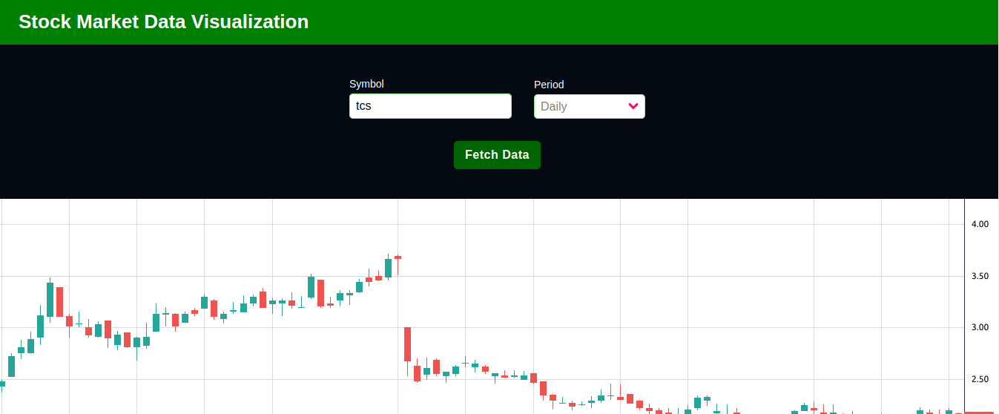
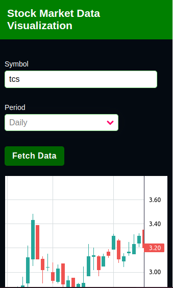

# Stock Market Data Visualization (Frontend)

This project is a simple Vue.js application that fetches and displays stock data based on user input. It utilizes the Alpha Vantage API to retrieve the necessary stock information and renders it using the Lightweight Chart library for visual representation. The application allows users to input the equity name and select the time period for which they want to view the data. 

## Desktop View

## Mobile View

## Features

- User-friendly interface to input the equity name and select the desired time period (daily or hourly).
- Data fetching and rendering of stock data using the Alpha Vantage API.
- Display of interactive and visually appealing stock charts using the Lightweight Chart library.
- Error handling for cases where the user provides an empty equity name.
- Implementation of a loading indicator to provide visual feedback while the data is being fetched and the chart is being created.

## Technologies Used

- Vue.js: A progressive JavaScript framework for building user interfaces.
- Alpha Vantage API: A financial data provider that delivers real-time and historical stock data.
- Lightweight Chart: An interactive financial charting library for technical analysis.

## Setup Instructions

To run the project locally, follow these steps:

1. Clone the repository.
2. Navigate to the project directory.
3. Install the necessary dependencies using `npm install`.
4. Run the development server using `npm run serve`.
5. Access the application in your browser at the provided local server address.

## Project Structure

The project structure is organized as follows:

- `public/`: Contains the main HTML file and other public assets.
- `src/`: Contains the main application files, components, and styles.
  - `components/`: Includes all the Vue components used in the application.
  - `App.vue`: The root component of the application.
  - `main.js`: The entry point of the application where the Vue instance is created.

## Acknowledgments

Special thanks to Alpha Vantage for providing the API and to Lightweight Chart for the interactive charting library.